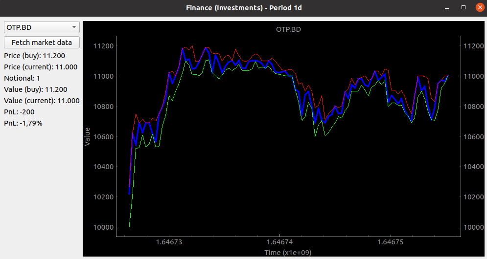

# Stock monitoring with Slack integration


## Autostart
For autostart create a `.desktop` file under the folder `~/.config/autostart` which has the following content:
```
[Desktop Entry]
Encoding=UTF-8
Name=Monitoring
Comment=Monitoring
Icon=gnome-info
Hidden=false
Exec=bash -c 'cd ~/<path-of-the-script> && python3 -m main'
Terminal=true
Type=Application
Categories=

X-GNOME-Autostart-enabled=true
X-GNOME-Autostart-Delay=0

```